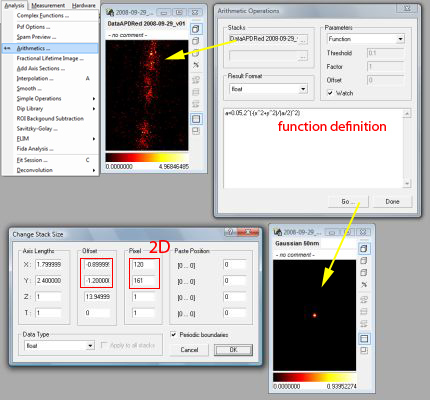
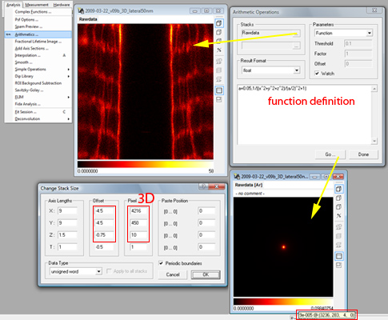
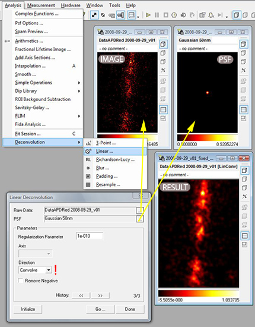
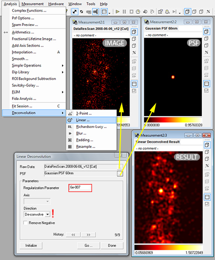
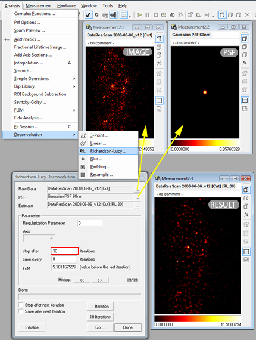

=====================================
Deconvolution
=====================================

In this chapter practical tips for performing a deconvolution of microscopic data with Imspector is given. First, some general remarks:

Deconvolution is often used in image processing to remove the influence of the properties of your imaging device (represented by the Point Spread Function (PSF)) on the acquired image. The image is thereby assumed to be a convolution of the original object (dye molecules) distribution and the imaging device's PSF (point spread function aka blurring function), all of which is additionally distorted by ever present noise of mostly gaussian or poissonian statistics.

While the resolution of your image cannot be improved by deconvolution in a strict sense (i.e. information cannot be added if it is not already there), the deconvolved image is often less affected by imaging noise as a side effect. The obtained representation is often interpreted as the best estimate for the unkown object which was to be measured. The goal of deconvolution is to find this best estimate.

However, especially for very dark images with a low number of collected counts (photons, ...) the usual deconvolution algorithms have to be applied with great care - the removal of noise also removes part of the information and we can end up with an useless or artifact-containing estimate. Also be aware that the deconvolved image is only an estimate of the object and can have systematic differences depending on the parameter of the deconvolution algorithm. Even small distances between peaks are normally preserved, however widths of objects in the order of the resolution can hardly be quantified (and indeed should not) and are somewhat arbitrary.

The deconvolution method allows to incorporate certain a-priori knowledge, like the positivity of the object or boundaries on the variation of objects. These are implemented for example by regularization parameter in Imspector.

And as a last thing: deconvolution can also be done only partly, e.g. when removing the sidelobes of the PSF of a 4Pi microscope.

Creating an idealized PSF
----------------------------

For a deconvolution process the knowledge about the PSF of the imaging system is mandatory. The measurement of the PSF is often compromised by noise itself, most of the times only parameters like its width are known with high significance. Sometimes the shape of the PSF can be approximated well by a gaussian or a lorentzian peak. In this case there is an easy way to compute such a PSF in Imspector to have it ready, when it is needed for deconvolution.

We demonstrate the creation of a data stack containing a single gaussian or lorentzian peak in the center of a data stack in 2D or 3D here. The more general task to compute am arbitrary function with arguments being a data stack is discussed elsewhere but very closely related.

   The image stack (upper middle) is a 2D stack with the offset set at minus half the stack length, as can be seen in :command:`Stack Size \& Data Type (Ctrl.+T)`. Selecting this stack in the :command:`Analysis/Arithmetics` menu, applying a function definition as explained in the text and clicking on :command:`Go` creates a new stack with identical dimensions and the image of a PSF.

   The image stack (upper middle) is a 3D stack with the offset set as needed. Selecting this stack in the :command:`Analysis/Arithmetics` menu, applying a function definition as explained in the text and clicking on :command:`Go` creates a new stack with identical dimensions and the image of a PSF. The new stack is displayed at frame zero for default, scroll to the middle frame of the stack (:command:`Pg.Up/Down`) to see the PSF's shape.}

Here is the recipe:

   1. Select an image stack that has the same size (physical and logical) as the PSF that you want to calculate. 
      This will be mostly a measured data stack. Check the data stack size by :command:`Right Click on Image/Manage and Manipulate Data/Stack Size \& Data Type` 
      and make sure, that the offset column is set to minus half the stack size [#]_
      and the physical size column has the right units [#]_
   2. While the stack is selected (stack window heading is highlighted) select the from the menu :command:`Analysis/Arithmetics` 
      and select function as parameters in the dialog box that has appeared.
   3. In the large edit box in the lower half of the dialog input you can input the formula to calculate your PSF. It will be fit into a 
      a new stack exactly the size as your image. For example enter  
      
         :parser:`a=0.05,2^(-(x^ 2+y^ 2)/(a/2)^2)` 

     for a Gaussian with width 0.05 in 2D, 
       
         :parser:`a=100,2^(-(x^2+y^2+z^2)/(a/2)^2)` 
         
     for a Gaussian with width 100 (for units see footnote) in 3D, 
     
         :parser:`a=0.05,1/((x^2+y^2)/(a/2)^2+1)` 
         
     for a Lorentzian with width 0.05 in 2D, or 
     
        :parser:`a=100,1/((x^2+y^2+z^ 2)/(a/2)^2+1)` 
       
     for a Lorentzian with width 100 in 3D [#]_. Adjust the formulas to your needs.

When clicking on :command:`Go` a new stack should appear with a single centered peak (in 3D stacks one can see it only after scrolling to the
central frame) which can be used in the following for deconvolving images. Imspector screenshots of the processes described above are
shown in figures \ref{fig:deconv_psf1} and \ref{fig:deconv_psf1}.

Convolution
--------------------------

   Demonstration of the convolution of two data stacks. The direction in the dialog should be set to convolve. First select two data stacks in the fields Raw Data and PSF. Both stacks must have same data type and stack size. Then click on Initialize and Go. The convolved image will be computed. Leave the dialog with click on Done.}

Smoothing is probably the easiest way to improve an image and is recommended especially for images with only a few counts where noise is 
the largest problem.. The blurring effect of the PSF is here not removed but even more enhanced. However, the noise is greatly reduced. 
The smoothing kernel will be in most cases a gaussian function. That means we have to provide a stack with equal physical and logical 
dimensions as the image stack (up to 4D possible) containing a centered gaussian function of certain width. Convolution of these two 
stacks (the order of the stacks can be exchanged thereby) is then performed via the menu command: 
:command:`Analysis/Deconvolution/Linear` as shown in figure \ref{fig:deconv_conv}.

Point Deconvolution
----------------------

TODO! Added later, important for 4Pi-data.

Wiener Filtering
-----------------------

Wiener Filtering or linear deconvolution is the optimal procedure when the image is compromised with gaussian noise. Its algorithm
is based in fourier space where the convolution of PSF and object is represented by a simple multiplication. The reverse operation, 
the division is therefore simple to implement and will fail only where the fourier transform of the PSF (the optical transfer 
function, OTF) is zero or has a small amplitude. These is unfortunately true for many high spatial frequencies in all pratical 
cases, therefore a regularization factor has to be added that dampens frequencies that were not transmitted very well and are 
dominated by noise and cannot be restorated therefore. The way to do it in the programm is via the menu command:
:command:`Analysis/Deconvolution/Linear` as shown in figure \ref{fig:deconv_lin}.

   Demonstration of linear deconvolution of two data stacks of equal size. The direction in the dialog should be set to 
   de-convolve and the regularization parameter should be set to the smallest possible value where the artifacts (due to
   ringing, negative values in result) is still tolerable, which is normally achieved by values between 1e-4 to 1e-8. 
   After selecting the image and the PSF (which are stacks of the same dimensions and the same data type) click on 
   Initialize then on Go. A new stack with the linearly deconvolved image will appear.

The regularization parameter has to adjusted so that the outcome is regularized properly. The scale for adjusting is mostly
logarithmic, we advice to try 1E-1, 1E-2, ... 1E-10 and values between. A lower regularization parameter will result in
largely overshooting positive and negative signal with many artifact. A larger than optimal regularization parameter
will result in a smoothed version of the image. [#]_

Because of the necessary regularization the resulting estimate is smoothed but sometimes does not get significantly
smaller as expected when removing the PSF influence (noise prevents hard deconvolution in this case).

Richardson-Lucy
------------------

When we additionally to Wiener Filtering want to impose the restriction of a purely positive object (e.g. dye concentration)
on the deconvolution process we end up with the Richardson-Lucy algorithm \cite{???}. This algorithm now is iterative, 
that means that next to a regularization parameter (as in the previous section to dampen the influence of high spatial
frequencies which are dominated by noise) we have the number of iterations to be made as an additional parameter.
The Imspector way of invoking this non-linear deconvolution method is via the :command:`Analysis/Deconvolution/Richardson-Lucy`
menu command as illustrated in figure \ref{fig:deconv_rl}.

   Demonstration of Richardson-Lucy deconvolution of two data stacks of equal size. First select the image and the PSF in
   the two upper lines of the dialog. This type of deconvolution is iterative, so an estimate (as starting point) can be
   given (but is never necessary). The number of iterations is normally not above 100. First click on initialize then 
   on Go. A new image appears. The estimate line is automatically replaced by the current result. Setting iterations 
   to 30 and clicking two times on Go is equivalent to setting iterations to 60 and performing the algorithm only 
   once. Intermediate results can be saved, a regularization parameter can additionally be set 
   (1-0.001 are good values) - resulting in smoothed images.

Although in principle the optimal regularization parameter can be estimated from statistical theory, this is almost 
never done in applications. If the optimal regularization parameter would be found, the algorithm could run forever, 
every number of iterations which is high enough would be sufficient. Another, more practical approach is to save
the resulting image after a fixed number of iterations each and choose from the images. In the beginning they 
will show too much blur, in the end, even the noise in the image will be translated to a crumbling structure, 
clearly representing artifacts. [#]_

.. [#] So the origin of the internal coordinate syste is at the center of the stack. 
.. [#] Will be microns or nm in most cases. Given is the edge length of the field of view. A unit is not given, however all parameters later on have to have the same units, whatever they are.
.. [#] The normalization in this case is so that the maximum of the stack 1 (in the center). Although sometimes 
   deconvolution algorithms expect a integral over the PSF of one (to resemble a probability distribution) this
   does not matter here in imspector and is always (not sure) done automatically if necessary.
.. [#] As a rule of thumb, we advice to adjust the parameter so that the smallest negative value present in the result is not more than 10\% in absolute value of the highest positive value.
.. [#] For most real world application we found an regularization parameter of 1E-10 and up to 100 iterations with stopping every 10 iterations sufficient.
 
