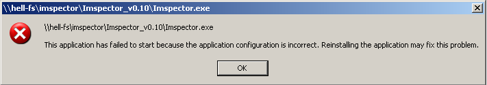
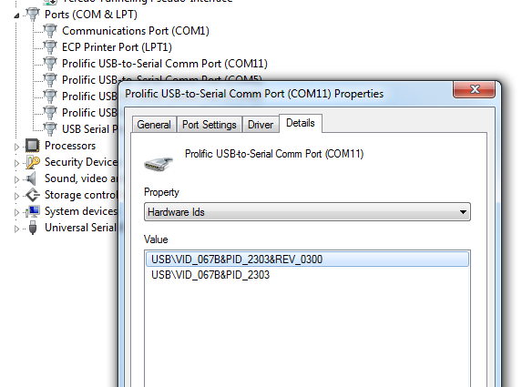
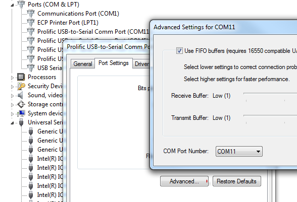

======================
FAQ
======================

This is a collection of common problems people encounter when using Imspector. Some are common misconceptions or
connected to bugs or shortcomings in other software / hardware, but most of them will probably be due to a bug or at
least an unintuitive feature of Imspector itself. In all cases a possible workaround is suggested. If the bug has been
 fixed or the feature changes in a later Imspector version, it is most probably mentioned here. Otherwise a quick look
in the (hugely incomplete) :ref:`Changelog` could help to see whether downloading a newer revision can help. 

Errors During Startup
----------------------

Imspector does not start because the 'application configuration' is incorrect.
*******************************************************************************

If Imspector never starts and instead you you see the following dialog

most probably you are missing the visual stuidio 2008 runtime. The problem is easy to fix, just download the
redistributable package from Microsoft here:

`Microsoft Visual C++ 2008 SP1 Redistributable Package (x86) <http://www.microsoft.com/downloads/details.aspx?familyid=A5C84275-3B97-4AB7-A40D-3802B2AF5FC2&displaylang=en>`_

and install it on your computer. Imspector should now start.

Registering Hardware Ports takes too long.
*******************************************

During startup, Imspector will take a long time before displaying 'Registring devices' or, in version since *v0.10rev4881*,
display a message **Registering hardware ports ... [Press and hold SHIFT + ESC to cancel]** in the splash screen.
The most probable cause of this is that you have some USB to serial or parallel port bridges installed that announce
ports but produce errors when accessing them. The reason for the delay are long timeouts. In older Imspector
versions you have to wait and, to speed up future startups try some of the solutions below.
In newer Imspector versions the problem is eliminated for serial ports, where initialization does no longer test-open the port.
Thus all ports present in the Device Manager (seen by the OS) will be added to the list but if you have a bad
bridge, opening them will fail when initializing a com device using them. While the problem has never been reported for
parallel ports they are test-opened to find out their capabilities and thus a delay may still occur. In this case
you can continue by pressing :kbd:`shift + escape` and the registration will continue in the background.
When you try accessing serial or parallel ports immediately after this (before initialization has finished) they
may be missing from the list of available ports.

Of course it is preferable to avoid the problem altogether and often removing the bridge from the USB port and
plugging it in again solves the problem temporarily. Alternatively, try to identify the offending ports by disabling
them in the device manager and enabling them one by one.

Also you should make sure that the newest drivers are installed for your device. These USB bridges are often cheaply produced and not labelled.
A convenient way to identify the correct drivers is to look for the hardware ids through the device manager.
Identify the device and go to the details tab. Select the **Hardware Ids** property and then google for the whole
string or the ids behind **VID** and **PID** (for example 067B and 2303). Often this points you in the right direction.

Hardware Initialization
-----------------------

COM ports beyond COM9 cannot be opened.
****************************************

When selecting COM ports COM10 and beyond initialization fails. This is a bug in older Imspector versions. You can
either switch to a newer version or you can rename the ports in question through the device manager. For this,
open port properties and click on the "Advanced Settings" button. There you may select a new port number. Often you
will need to disconnect and re-connect the device afterwards to re-initialize the driver.

Measurement Configuration
-------------------------

Is it possible to time two (or more) configurations in Imspector so that one automatically starts directly after the other?
***************************************************************************************************************************

Yes it is. Create several 'Configurations' (also called 'Property Sets') in your measurement template (by pressing
the STOP button, i.e. the one with the square on it). You can see available configurations in the 'Configurations'
live dialog and change between them by clicking on the entries. You can then edit the settings independently for each of them.
Usually this is a way to combine e.g. an overview scan and the measurement in the same template but there is an option
:menuselection:`&Mesurement --> Loop Through Property Sets` that does exactly what you want. It will run a
measurement for each 'Property Set' in the order they are defined.
More sophisticated control will only be available when Imspector finally has python embedded as a scripting language.
