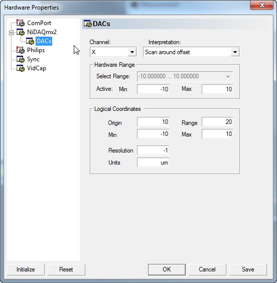
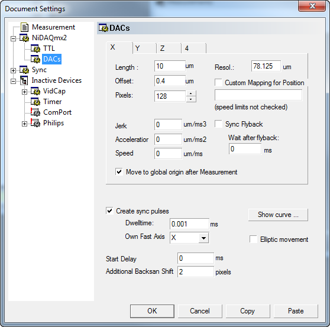
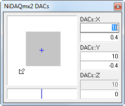
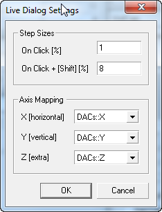

#######################################
DAC Scanning Channels
#######################################

There is a generic interface to digital-to-analog scanning channels that are e.g. provided
by :ref:`NiDAQmx`. It allows you to configure the scan range, fixed position during the measurement,
the sync settings and line, pixel and frame clock.

The interface currently contains a hack to allow fast 2D scanning which will disappear as soon
as it is included in the main Imspector hardware control.

Devices providing such generic channels usually have sub-pages to their hardware 
configuration pages:

and for the per-measurement settings a page that is added below the main configuration page of the
device, usually titled 'DACs'.

Also, a Live Dialog is registered that allows adjustment and visual control of the scan range during the
scan.

If you right-click on the dialog a menu appears with the commands

*Maximum Range*
   Reset the scan range to its maximum. 

   .. note::
      
      If you have hardware limits in place (see above) the maximum scan range is almost always invalid as 
      it requires infinite acceleration before flyback (the linear range reaches the edge of the valid range
      and there is no space to de-accelerate slowly).

*Center actual scan area*
   Center the scan area inside the valid range

*Center origin*
   Center the origin

*Settings*
   Adjust settings (see below).
 
   
Its behaviour can be adjusted through the settings dialog

