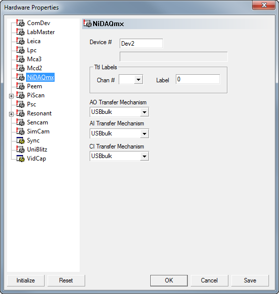
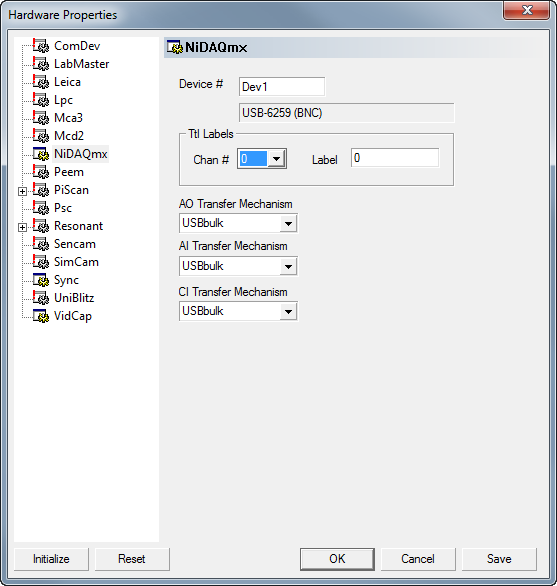

.. _NiDAQmx:

#######################################
NiDAQmx Cards
#######################################

Driver vor National Instruments DAQ cards that can be interfaced with the NiDAQmx 
suite of drivers.
During configuration Imspector has to be restarted once to allow the driver to register
the correct amount of analog out (AO), analog in (AI), TTL (TO) and counter (CI) channels.
Create a new device and enter the device id as found in the Measurement&Automation explorer
into the configuration dialog.

Initialize the device by pressing the 'Init' button. Then restart Imspector and return
to the configuration dialog. It should now include additional device information

