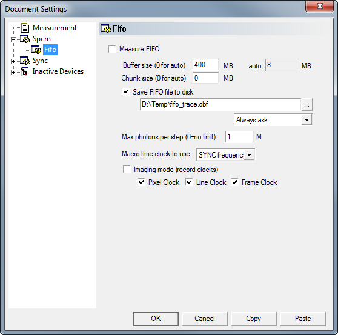

.. _Spcm:

#######################################
Becker&Hickl SPCM Cards
#######################################

Configuring the Card
---------------------

Many time correlated single photon counting cards from Becker&Hickl are supported or support can be added on request.
In the hardware configuration dialog the settings that concern all measurements are chosen:

Set the module number and initialize the device by pressing the 'Init' button. Check whether the Type displayed is correct. 
Most settings are analogous to the B&H software, please refer to their documentation for now.

Configuring Measurements
-------------------------

The settings for each measurement offer different possibilities than the 
B&H software. Most of them are self explanatory and this documentation may grow when time is at hand.

Multi-channel measurements
***************************

To use a router in order to record several channels, enter the appropriate channel number. In the 'Map to stacks ...' entry you can enter a list of stack names separated by ':'. You need exactly as many channels as there are router channels. For example 

**Ch1:Ch2:Ch3:Ch1** 

would be a valid string when using four channels. It would acquire 3 data stacks, mapping channels 1 and 4 to a stack named 'Ch1', channel 2 to a stack named 'Ch2' etc.

Global Timegates
*****************

Importantly, if 'Generate Histogram' is not selected and no FIDA analysis is to be applied, timegates can be chosen.

Either check 'Global Timegate'. This enables a global timegate for all channels. The configuration string is of the form '<b1>-<e1>[&<b2>-<e2>]...', i.e. a list of bin ranges to be included in the histogram separated by '&' characters (',' characters are also allowed due to backwards compatibility).

Channel-specific Timegates
***************************

Alternatively, global timegates can be de-selected and the channel mapping can be used to apply timegates. Instead of a simple name, the entry for a physical routing channel can consist of a list of assignments, separated by commas. Each assignment in turn has the form '<b1>-<e1>[&<b2>-<e2>]...@<name>' assigning one or several ranges of bins to a stack labelled with <name>. For example with one routing channel:

**10-40&50-80@Ch2,90-220@Ch1**

Would assign bins 10-40 and 50-80 to a stack 'Ch2' and bins 90-220 to a stack named 'Ch1'. For more physical channels:

**10-40&50-80@Ch2,90-220@Ch1:10-120@Ch2**

would do the same and assign bins 10-120 of routing channel 2 to the stack 'Ch2'. If several assignments to the same stack occur, they are added in the process.

FIFO Measurements
------------------

The card can stream FIFO data to the disk during the measurement. Imspector then displays histograms calculated from the traces.
This FIFO imaging mode is not fully functional. If an axis is synced it will ignore it and display all events added for this axis.

Live Dialogs
------------

Some settings can be altered while the measurement is running through the Live dialog.

Rate monitor
------------

Updated every second this displays current rates in Hz

