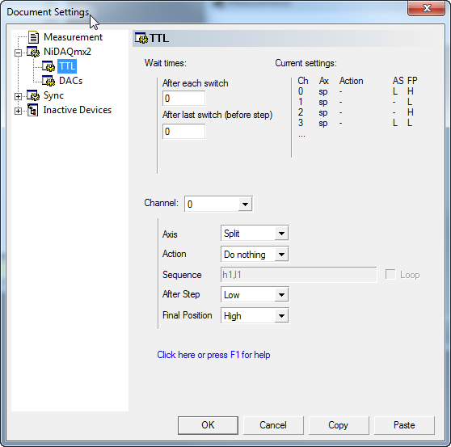
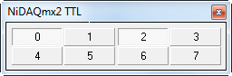

#######################################
TTL Channels
#######################################

There is a generic interface to TTL channels that are e.g. provided by :ref:`NiDAQmx`. It allows you to configure
switching sequences etc.

Devices providing such generic channels usually have sub-pages to their measurement configuration pages:

Wait times
----------
All wait times refer to switching that goes on during a step on a non-synced axis. Along synced axes, all timing is
governed by the dwell time and a TTL channel can only switch once per step on the fastest axis. On higher synced
axes, the time between switches is given by the dwell time per pixel.

*After each switch*
   If a any of the TTL channels has selected a sequence as action that defines a pattern of several switches before
   the step, this is the wait time between consecutive switches. All patterns are put out simultaneously.

*After last switch (before step)*
   The time to wait after all pattern are output before the exposure / measurement of the step is started.

*After last switch (after step)*
   The time to wait after the exposure and after the TTL channels are switched to their 'After Step' state.

Current settings
----------------
A quick overview over the settings of all channels that are not off.

Channel action settings
------------------------

These settings control the behaviour of a TTL channel during the measurement. You select the channel to be configured
through the *Channel* combo box.

**Axis**
  If action is sequence, this defines the action axis. Upon each move along this axis, the TTL channel moves through
  its sequence. If a synced axis is selected different rules apply to how the sequence setting is interpreted. See
  [_TTLsynced]_ for details. Please note that you can select the split axis which is defined in the Measurement
  settings. This allows you e.g. to acquire two images with different TTL settings. Frequently this is used for
  taking a STED and a confocal image simultaneously.

**Action**
  Valid actions are

  *Do nothing*
     No action is performed. The TTL channel stays in the state it had before the measurement.
     If the state is changed through the live dialog (see below) this state will remain after the measurement unless
     the 'Final Position' parameter is set.
  *Keep high*
     During each exposure the TTL channel will be high. This can be changed to *Keep high* during the measurement through the live dialog.
  *Keep low*
     During each exposure the TTL channel will be low.
  *Sequence*
     The TTL channel's state can change whenever a movement occurs on the selected **Axis** according to the sequence setting.

**Sequence**
  Defines a switching sequence. It is a comma separated list of states ('h' or 'l') each followed by a number defining the number
  of steps the state should remain unchanged afterwards. e.g.

  *h1,l1* 
    Will set the state to high for one step, to low for the next. If **Loop** is selected it will thus alternate between high and
    low, otherwise it will remain low after the second step.
    The '1' can be omitted, the sequence is equivalent to 'h,l'.

  *h2,l2,h,l*
    Will set the state to high for two steps and then to low for three, then to high for one and to low for one.

  For some applications some switching pattern may be needed. This can be defined by a letter sequence, each defining the TTL
  channel to be in the corresponding state for the time defined by the wait time *After each switch*.
  For example

  *hl,hlhl2,hlhlhl*
    Will switch to high and then to low before the first exposure. Switch to high, low, high, low before the second exposure and
    remain low for the third and switch three times before the third exposure.

**Loop**
  Whether to restart with the first entry in the sequence when there are more steps along axis. If not selected, the channel remains
  in the last state defined in the sequence.

**After Step**
  The state to put the TTL channel in after the exposure is finished. This will happen after each exposure independently of which 
  action is selected or, if sequence is selected, independently of whether the selected axis has moved.
  For example, if *Keep high* is selected, but **After Step** is set to *Low* the channel will be set to high before each exposure
  and to low after each exposure.
  If *No change* is selected, the TTL state remains the same as during the exposure.

**Final Position**
  If this is set it ensures that the TTL channel is set to the specified state after the measurement irregardless of the state it was
  in before the measurement.
  If *No change* is selected, the TTL channel returns to the state it had before the measurement was started or, if the selected **Action**
  was *Do nothing* it remains in the current state (which may have been changed during the measurement through the live dialog).

.. note::

   The switching does not occur instantaneously as it is controlled by the computer. Also whether the device switches 
   before or after actions by other devices depends on the order they have in the hardware list. 

.. [_TTLsynced]

Synced axis behaviour
---------------------

TTL switching along synced axes is not fully functional. Stay tuned for updates.

Live Dialog 
-----------

Most TTL channel instances will also register a Live Dialog that allows adjustment of the TTL level during and after the measurement. In short, a 
button which is checked means the level of the TTL channel is high.

During a measurement, pressing buttons alters their state (they are disabled if the TTL channel runs a sequence). This state change will also 
modify the action setting (if it was *Kepp high/low*). In this case the TTL channel will return to its pre-measurement state after the measurement 
finishes regardless of whether the state was changed during the measurement. See also **Final Position** above.

