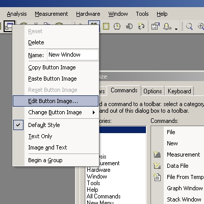
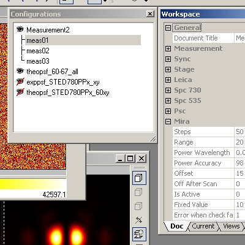
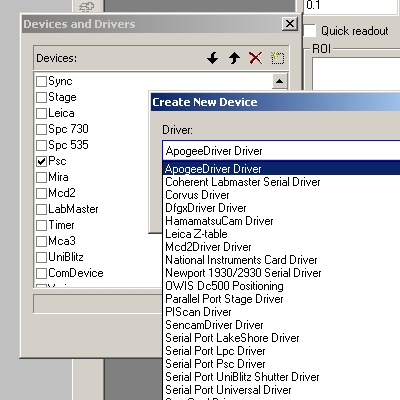
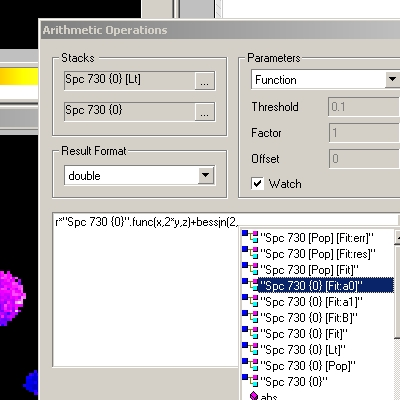
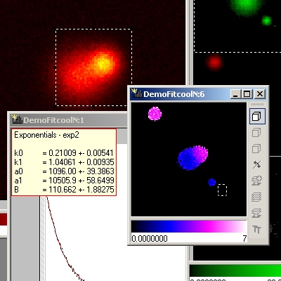
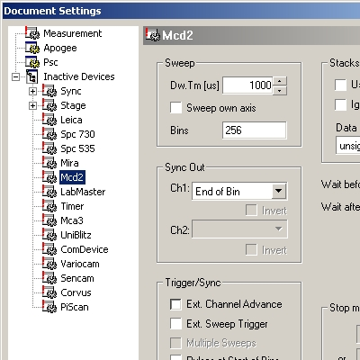
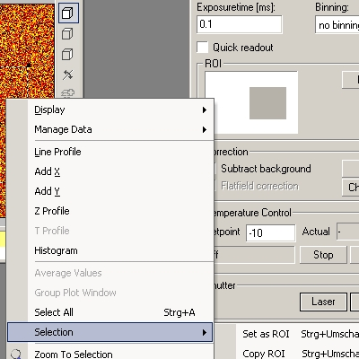

============
Introduction
============

Imspector is a robust software system for experimental control and quantitative data 
analysis in microscopy and spectroscopy. Integration of data processing and acquisition 
allows real-time analysis and visualization of experimental results.

   State of the art customization of toolbars, menus and shortcuts.

   The workspace allows you to keep track of all your measurements, temporarily 
   hide documents to keep the desktop clean and it provides access to all parameters relevant for the 
   current measurement or analysis.

   Add new devices derived from standard or custom drivers.

Imspector offers a variety of functions for speed-optimized visualization of up to 
4-dimensional data as graphs and pictures, an intuitive user interface and access 
to analysis methods. Data can be graphically cropped, moved, copied and combined 
in overlays. In addition to ordinary cuts, zooming, multi-channel display and 
user-defined color tables many tools are provided that are especially useful in 
quantitative microscopy. There are tools for the calculation of point-spread 
functions and simple linear de-convolution, frequency filtering etc. A tool for 
off-line nonlinear de-convolution is also included.

   Use the built-in parser to analyse and process your data.

   Nonlinear fitting of single data curves or e.g. along the time axis of a TCSPC stack in each spatial point

A built-in function parser allows for user-defined filters, transformations and 
other numerical operations on the data and as part of the 'FitPlugin' nonlinear 
parameter fitting with user-defined functions and a choice of several optimized 
algorithms.

Imspector imports and exports many commonly used data formats and communicates 
with other applications as e.g. Origin, Photoshop, Freehand and Excel through 
cut- and paste operations. 

Hardware drivers exist for analog output devices, multi-channel scales, time 
correlated single photon counting, various CCD cameras (e.g. Apogee, Hamamatsu, PCO), 
laser power controllers, positioning stages, PiFocs etc. adding the ability to control 
new hardware compo-nents is straight-forward and achieved through a Plugin. Such 
hardware drivers can provide dialogs for hard- and software-specific settings and 
parameter adjustment during measurements. Data readout can be synchronous or 
asynchronous, the program handles the measurement flow, synchronization of different 
devices and the coordination of data readout, analysis and visualization during 
he measurement.

   An intuitive GUI allows you to adjust your measurement parameters.

   All measurement parameters are remembered. So you can derive measurements from previous 
   ones, image regions of interest etc.

The program administers the settings defined by the Hardware drivers and allows 
the creation of template measurements including embedded analysis and visualization. 
Measurements can therefore be repeated at any time with identical settings by 
simply pressing a button. Experimental data is always saved together with all 
relevant settings for later reference.

All data dependencies are remembered by the program so if data changes during a 
measurement or manual processing all necessary steps to update dependent data 
are repeated auto-matically. Imspector will even remember dependencies on data 
saved on disk and can 'watch' these files and re-load them if necessary. It can 
therefore serve as a graphical front-end for your command-line numerical analysis tools.
All such dependencies, as well as settings and window positions are conserved 
when saving and re-loading documents.

Many features of Imspector were inspired by its users in the department for
NanoBiophotonics at the MPI f. biophysical chemistry. Not all of them found
their way into this documentation as of now. Also, Imspector is under constant 
development, so features might be added or functionality might be replaced by 
supreior implementations. Thus some of the information presented here might be
outdated. Anybody is encouraged to explore the context-menus - a lot of 
the functionality is intuitive enough to figure it out by trial and error.
For news check the `imspector webpage`_.

Imspector has been developed in the |NanoBio|_  at the |MPI|_ in Göttingen. 
It is currently sold to third parties through `Max-Planck-Innovation`__. 

__ Shop_

Imspector was always and is currently lacking appropriate documentation. This is 
the second or third shot at creating some useful manual and I hope you will see lots
of updates here soon.
All users of Imspector are welcome to contribute. The source format of this manual is 
restructured text and I am using sphinx to create the 
manual from it. You may send manual pages or sections in any format and I will incorporate 
them. Upon request you may also gain access to the subversion
repository of the manual source.

If you are using imspector for your data acquisition or analysis and would like to cite the program or its documentation please use the following reference:
	
	| Schonle A., 2006. *Imspector Image Acquisition & Analysis Software*, v0.1
	| http://www.imspector.de
    

